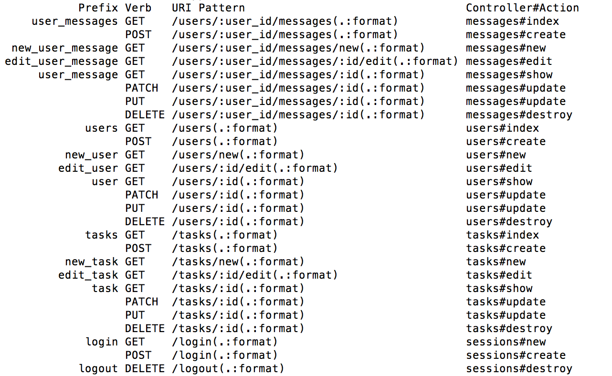
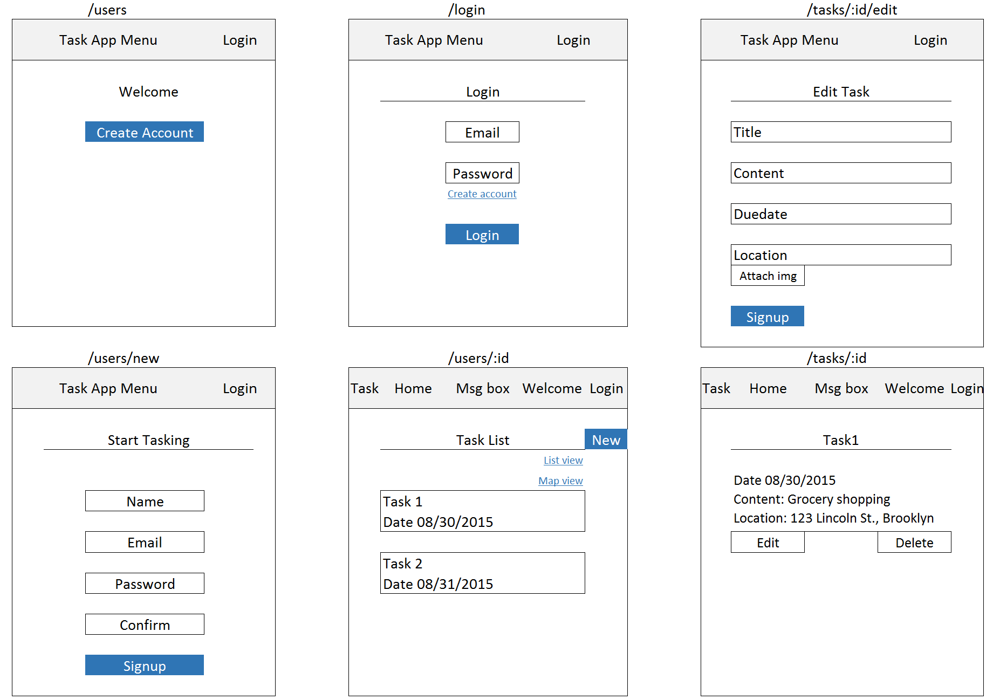
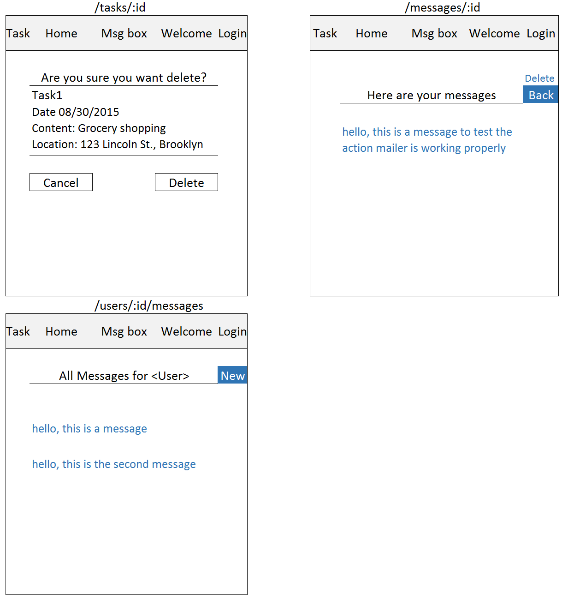
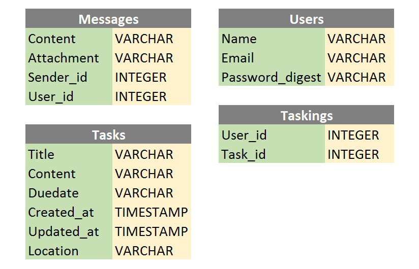
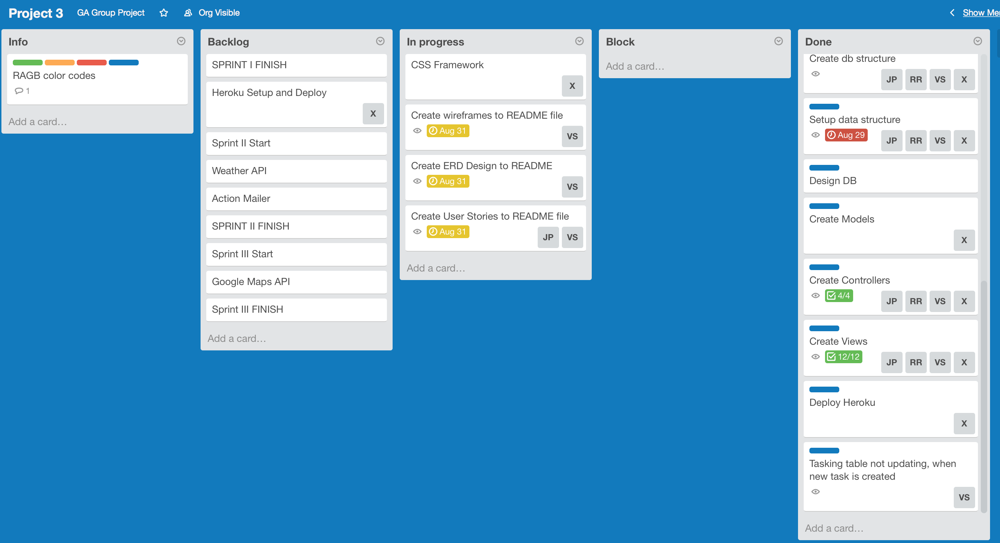

##########################################################################

## Project 3 - Task App

### Project Description

TaskIt is a revolutionary task planner for all your daily needs.
TaskIt incorporates all aspects of your personal planner, including weather forcasts,
geolocation, and mapping to ensure you are organized and prepared for any task. Not only does TaskIt allow you manage your own task calendar, it allows you to interact with other users. 
TaskIt has a unique messaging feature where users can message eachother and send invitations to 
particular tasks.  TaskIt, organize your everyday.

### Team
* Jacqueline Potts
* Xi Zhang
* Reyes Rodriguez
* Viktoria Szontagh

### Technologies
* HTML/ ERB templating
* CSS
* JS
* Ruby on Rails
* PostgreSql
* Active Records
* API

### Artifacts
#### User Stories
* User can create a user profile/ Sign in to the page
* User receives welcome email after successful sign up
* User can their tasks and messages by logging in
* User can sign in with existing user account
* User can see all the tasks created by him/her
* User can create a new task
* User can assign a due date for task using a calendar
* User can add attachments to tasks and messages
* User can only see the attachments if they exist
* User can see the location of the task in the map view
* User can edit current tasks
* User can delete their own tasks
* User receives a secondary confirmation for deletion, in can case he/she changes his/her mind
* User can see the weather forcast of the location on the day of the task
* User can send a private message to any existing user
* User can log out of his/her account for privacy
* A User's private task list cannot be accessed by unauthorized people
* User can share a task with other users

#### Front-End Wireframes

#### Routes

#### Database Design(ERD Diagrams)

### Agile Development

### Trello Board
[Trello](https://trello.com/b/5ngCFpBF/project-3)

### Heroku
[GitHub](https://secure-badlands-5616.herokuapp.com/login)

### Resources
